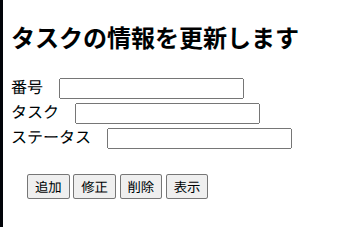
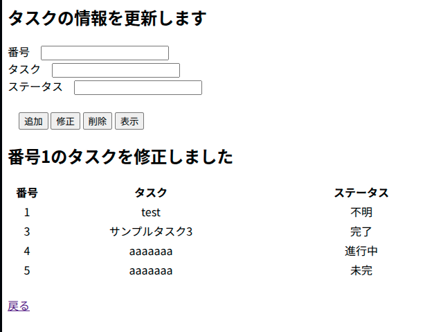

# Todoリスト Webアプリケーション (学習用)

## 概要

このプロジェクトは、JavaサーブレットとJSPを使用して作成されたシンプルなTodoリスト管理アプリケーションです。  
Webアプリケーションからデータベースの登録・更新・削除処理を実装する学習の一環として開発しました。

### 主な画面

- **タスク操作画面 (`editTodo.html`)**  
  新しいタスクの追加や、既存タスクの修正・削除を行うための入力フォームです。

  

- **タスク一覧表示画面 (`editTodo.jsp`)**  
  データベースに登録されている全タスクを一覧で表示します。

  

## 制作の目的と参考資料

データベースと連携したWebアプリケーションの基本的なCRUD（作成、読み取り、更新、削除）処理を学ぶことを目的としています。

主に以下のYouTube動画を参考に学習を進めました。
- **参考動画:** [【JavaDB12】webアプリからデータベースの更新処理をする方法](https://youtu.be/C6O-9YTcyqM?list=PLru8-xuz0YvzEE_qHslDvFaRXxR_Q8m6y)

### このプロジェクトを通じて学んだこと

- **MVCモデルの基礎:**
    - **Model:** `TodoBean` (データ) や `TodoDAO` (ビジネスロジック)
    - **View:** `editTodo.jsp` (画面表示)
    - **Controller:** `EditTodoServlet` (リクエスト制御)
- **データベース連携 (JDBC):**
    - `DriverManager` を用いたMySQLへの接続・切断処理
    - `Statement` を利用したSQLクエリの実行
    - `ResultSet` からのデータ取得とJavaBeansへのマッピング
- **サーブレットとJSPの連携:**
    - HTMLフォームからのデータ受信 (`req.getParameter()`)
    - リクエストスコープへのデータ格納 (`req.setAttribute()`)
    - `RequestDispatcher` を使ったJSPへのフォワード処理

## 使用技術

- **言語:** Java
- **Webサーバー:** Apache Tomcat
- **データベース:** MySQL
- **フロントエンド:** JSP, HTML
- **API:** Servlet API, JDBC

## セットアップ

1.  MySQLに`todo_app`データベースと`tasks`テーブルを作成します。（`initialize.sql`参照）
2.  `TodoDAO.java`内のデータベース接続情報を自身の環境に合わせて修正します。
3.  プロジェクトをコンパイルし、Tomcatの`webapps`ディレクトリにデプロイします。
4.  Tomcatを起動し、指定のURLにアクセスします。 