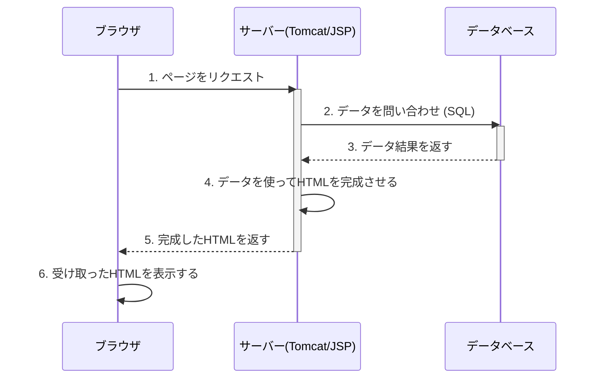
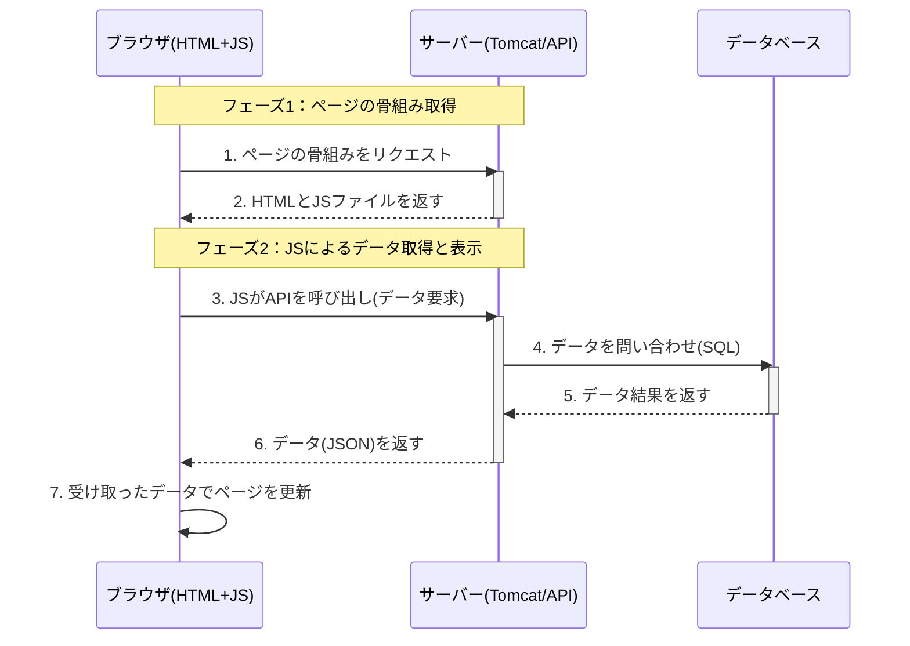

## はじめに

「JavaScriptでリッチなWebページが作れるのに、なぜJSPのような昔の技術が必要なの？」
「そもそも、なんでJavaScriptは直接データベースの情報を取ってこれないの？」

JavaでWeb開発を学び始めると、誰もが一度はこんな疑問にぶつかります。筆者もそうでした。

この記事では、このWeb開発の根本的な仕組みを、多くの人がイメージしやすい**「レストランの厨房」**の例え話を使って、直感的に理解できるように解説します。

この記事を読み終える頃には、JSPとAPIの役割の違いがスッキリ整理され、「なるほど、だからAPIが必要なのか！」と納得できるようになるはずです。

## 大前提：お客さん(JavaScript)は、厨房(データベース)に入れない！

まず、Web開発における絶対的なルールを一つだけ覚えてください。

> **セキュリティ上の理由から、ユーザーのブラウザで動くJavaScriptは、サーバーのデータベースに絶対に直接接続できない。**

もしこれができてしまうと、Webサイトのコードを解析するだけでデータベースのIDやパスワードが盗まれ、悪意のある人にデータを全て破壊されたり、個人情報を抜き取られたりしてしまいます。

この大原則があるからこそ、JSPやAPIといった**「安全な仲介役」**が必要になるのです。

## レストランへようこそ！登場人物の紹介

それでは、私たちのレストランの登場人物を紹介します。

- **あなた (お客さん)** = ブラウザ上で動く **JavaScript**
- **厨房** = サーバーの **データベース (MySQLなど)**
- **ウェイターさん** = **API**
- **シェフと厨房スタッフ** = サーバーサイドのプログラム (**Java**など)

この関係性を頭に入れて、2つの異なるサービス形態（アーキテクチャ）を見ていきましょう。

## 方式1：JSPで作るWebページ (サーバーサイド・レンダリング)

これは、**サーバー側で料理(HTML)を完全に完成させてから、お客さんのテーブルに届ける**方式です。昔ながらの伝統的なレストランのイメージです。

**ストーリーの流れ**
1. **注文**: あなた(ブラウザ)は席に着き、「シェフのおまかせコースをお願いします」と注文します (特定のURLにアクセス)。
2. **調理と盛り付け**: 注文を受けた厨房スタッフ(サーバー/Java)は大忙しです。
    - 冷蔵庫(データベース)から食材を取り出し…
    - シェフ(Javaプログラム)が調理し…
    - **一枚の豪華な大皿に、全ての料理を美しく盛り付けます**。(← **これがHTMLの生成処理**です)
3. **提供**: 厨房スタッフは、**完璧に完成した大皿料理(完成品のHTML)**を、あなたのテーブルに運びます。
4. **食事**: あなた(ブラウザ)は、運ばれてきた料理をただ食べる(表示する)だけです。



JSPの世界では、`for`文などを使って、データベースから取得したデータの数だけ動的にHTMLのテーブル行(`<tr>`)などを生成します。まさに、サーバーという厨房でHTMLを調理している感覚です。

```jsp:editTodo.jsp
<%-- for文でリストの数だけループ --%>
<% for(TodoBean tb : todoList){ %>
  <tr>
    <%-- データベースの値を埋め込んでいく --%>
    <td><%= tb.getId() %></td>
    <td><%= tb.getTask() %></td>
  </tr>
<% } %>
```

**JSP方式のポイント**:
- 仕事の主役は、すべて**サーバー側(厨房)**。
- サーバーは**完成品のHTML**を送る。
- ブラウザはそれを受け取って表示するだけ。

---

## 方式2：JavaScript + APIで作るWebページ (クライアントサイド・レンダリング)

こちらは、**まず空のお皿だけをテーブルに置き、後からウェイターさんが一品ずつ料理を運んでくる**方式です。モダンなレストランのイメージです。

**ストーリーの流れ**
1. **来店**: あなた(ブラウザ)は席に案内されます。テーブルの上には**空のお皿(骨組みだけのHTML)**と、**呼び出しベル(JavaScript)**だけが置かれています。
2. **注文 (リクエスト)**: あなたは呼び出しベル(JavaScript)を鳴らし、やってきた**ウェイターさん(API)**に「まず、前菜をください」と注文します。
3. **伝達と調理**: ウェイター(API)は厨房(データベース)に注文を伝えます。厨房では、シェフが前菜だけを調理します。
4. **提供 (レスポンス)**: ウェイター(API)は、**前菜だけ(JSONデータ)**をあなたのテーブルに運びます。
5. **食事 (表示)**: あなた(JavaScript)は、運ばれてきた前菜を、自分でお皿の上に並べます (DOM操作でページに表示)。
6. **追加注文**: あなたは再びウェイターを呼び、「次はメインのステーキを」と注文し、運ばれてきたらまた自分でお皿に並べます。



この方式では、JavaScriptが`fetch`などの機能を使ってAPI(ウェイター)を呼び出します。サーバー(API)はHTMLではなく、データに特化した**JSON**という形式で返信するのが一般的です。

```javascript:main.js
// API(ウェイター)に「タスクのデータをください」とお願いする
fetch('/api/todos')
  .then(response => response.json()) // JSON形式でデータを受け取る
  .then(todos => {
    const table = document.getElementById('task-table');
    // 受け取ったデータを使って、自分でHTMLを組み立てる
    todos.forEach(todo => {
      const row = table.insertRow();
      row.innerHTML = `<td>${todo.id}</td><td>${todo.task}</td>`;
    });
  });
```

```json:サーバーからの返信 (JSON)
[
  { "id": 1, "task": "牛乳を買う" },
  { "id": 2, "task": "部屋を掃除する" }
]
```

**JavaScript+API方式のポイント**:
- 仕事の主役は、**ブラウザ側(お客さん)**。
- サーバー(API)は聞かれた**データ(JSON)を返すだけ**。
- ブラウザ(JavaScript)がデータを受け取ってから、ページを完成させる。

## まとめ：結局何が違うのか？

| 比較項目 | JSP方式 (サーバーサイド) | JavaScript + API方式 (クライアントサイド) |
|:---|:---|:---|
| **仕事の主役** | **サーバー** | **ブラウザ (JavaScript)** |
| **サーバーが送るもの** | **完成品のHTML** | 骨組みHTMLと、後から**データ(JSON)** |
| **役割** | **JSP**: HTMLを生成する技術 | **API**: JSとサーバー間の安全な**通信ルール(窓口)** |
| **ユーザー体験** | ページ遷移ごとに画面が再読込される | ページの一部だけがスムーズに書き換わる |
| **適した用途** | 伝統的なWebサイト、企業の管理画面など | Gmailのような高機能なWebアプリ(SPA)、スマホアプリ連携 |

JSPは「昔の技術」なのではなく、「サーバーでHTMLを完成させる方式の代表格」です。一方、APIは「JavaScriptが安全にデータを取得するための必須の窓口」なのです。

どちらが良い・悪いではなく、作りたいアプリケーションの特性によって使い分ける、というのが現代のWeb開発の姿です。

この記事が、あなたの学びの助けになれば幸いです！

---

## 補足：API方式へ移行して、何が便利になったのか？

では、なぜ現代のWeb開発ではJSP方式よりもAPI方式が主流になってきているのでしょうか？それは、API方式に移行することで得られる、3つの大きなメリットがあるからです。

### 1. ユーザー体験(UX)が劇的に向上する

これが最大のメリットです。

- **JSP方式**: リンクをクリックするたびに、ページ全体が一度真っ白になってから次のページが表示されます。これは、FAXで次のページが送られてくるのを待っている感覚に似ています。
- **API方式**: ページ全体を再読み込みすることなく、**必要な部分だけがスムーズに更新**されます。GmailやGoogleマップが、まるでPC上のアプリのようにサクサク動くのはこのおかげです。

このように、単一のページ内でコンテンツを動的に書き換えて、滑らかな操作感を実現するアプリケーションを **SPA (Single Page Application)** と呼び、API方式はこのSPAを実現するための根幹技術となっています。

### 2. チーム開発の効率が上がる (役割分担の明確化)

APIという「メニュー（共通の仕様）」さえ決めてしまえば、「見た目を作る人」と「裏側の仕組みを作る人」が完全に分業できます。

- **フロントエンドエンジニア**:
  - **担当**: 見た目と使いやすさの追求 (React, Vue.jsなど)
  - **考えること**: 「APIからこういうデータが来るから、それを元にかっこいい画面を作ろう」
- **バックエンドエンジニア**:
  - **担当**: データ処理やセキュリティの追求 (Java, Ruby, Goなど)
  - **考えること**: 「フロントエンドからリクエストが来たら、このデータを間違いなく返してあげよう」

これは、レストランで言えば「内装デザイナー」と「厨房のシェフ」が、お互いの領域に干渉せず、自分の専門分野に集中できるのと同じです。これにより、大規模なチームでもスムーズに開発が進められます。

### 3. "コード"を様々なプラットフォームで使い回せる

JSPがWebページ(HTML)しか作れないのに対し、APIが提供するのは**特定の見た目を持たない純粋なデータ(JSON)**です。これがビジネス上、非常に大きな意味を持ちます。

一度しっかりしたAPI（ウェイターと厨房）を準備してしまえば、**様々な種類のお客さん（プラットフォーム）に対応できる**ようになります。

- **Webブラウザ (PC/スマホ)** → 同じAPIを利用
- **iPhoneアプリ (iOS)** → 同じAPIを利用
- **Androidアプリ** → 同じAPIを利用
- **外部企業とのシステム連携** → 同じAPIを利用

プラットフォームごとに裏側の仕組みを作り直す必要がないため、**開発コストと時間を大幅に削減できる**のです。これが、現代のサービス開発においてAPIが不可欠とされる大きな理由の一つです。 